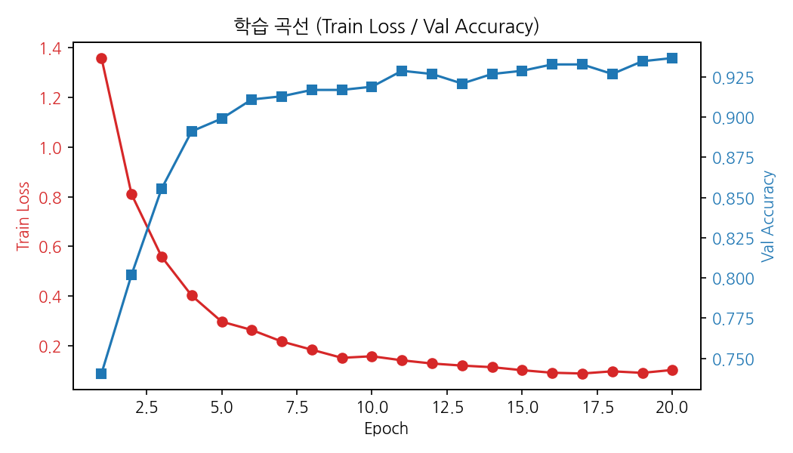
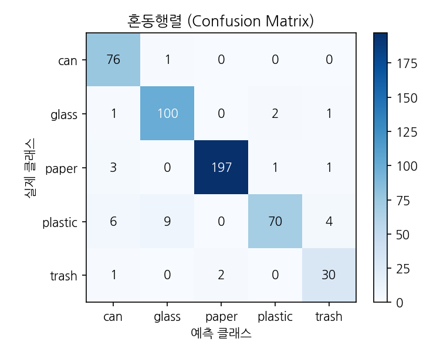
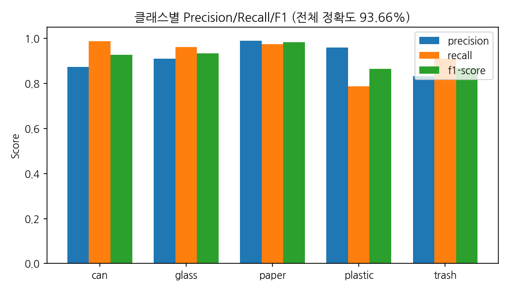

# ♻️ 분리수거 판별 어시스턴트

> **YOLO 게이트 + CNN 분류 + LangChain RAG** 로 쓰레기 재질을 판별하고 분리배출 방법을 안내하는 딥러닝 + LLM 과제입니다.

<table>
  <tr>
    <td>📅 <b>기간</b></td>
    <td>2026년 07월 02일 ~ 07월 06일 (5일)</td>
    <td>👤 <b>팀원</b></td>
    <td>1인 · 김승현</td>
  </tr>
</table>


---

## 📋 과제 개요

| 항목 | 내용 |
|---|---|
| 🎯 **주제** | 쓰레기통에 사진을 던져 넣으면 재질을 판별해 알맞은 분리수거함으로 안내 |
| 🤖 **탐지** | YOLOv8n (COCO 사전학습, 파인튜닝 없음) — 물체 개수 게이트 |
| 🧠 **분류** | CNN 전이학습 (EfficientNet-B0) — 플라스틱/캔/유리/종이/일반쓰레기 5클래스 |
| 👁️ **이물질 판정** | Qwen2.5-VL(HF API) 오염 감지 + 확신도 임계값 — 재활용 불가 시 일반쓰레기로 안내 |
| 💬 **LLM** | LangChain RAG + Qwen2.5 7B (로컬 Ollama / 배포 HF Inference API 이중화) |
| 🖥️ **학습 환경** | Google Colab T4 GPU (로컬 GPU 없음, 추론은 CPU) |
| 🚀 **결과물** | Streamlit 데모 앱 — 쓰레기통 드래그드롭 업로드 + 투입 애니메이션 + 챗봇 |

---

## 🗺️ 전체 파이프라인

```
📷 사진 업로드 (큰 쓰레기통 투입구 — 클릭 또는 드래그드롭)
     ↓
🔍 YOLO 게이트 (model/detect.py) — COCO 사전학습 YOLOv8n, 학습 없이 그대로 사용
   물체 개수 판정
     ├─ 0개  → "쓰레기를 찾지 못했어요. 다시 업로드해주세요."
     ├─ 2개+ → "쓰레기가 여러 개 감지됐어요. 하나만 나오게 다시 업로드해주세요."
     └─ 1개  → 박스 영역 crop
     ↓
🧠 CNN 분류 (model/predict.py) — EfficientNet-B0 전이학습, TrashNet 5클래스
   plastic / can / glass / paper / trash
     ↓
👁️ 이물질·확신도 판정 (model/vision.py) — Qwen2.5-VL 오염 감지 + 확신도 70% 임계값
   trash로 분류되거나, 이물질 감지되거나, 확신도가 낮으면 → 일반쓰레기行
     ↓
🗑️ 쓰레기통 투입 애니메이션 — crop 이미지가 알맞은 분리수거함으로 날아가 들어감
     ↓
📚 LangChain RAG (rag/chain.py) ← Chroma 벡터DB ← 분리배출 가이드 문서
   분류 결과 + 사용자 질문 → 근거 문서 검색 → 배출 방법 답변 생성
     ↓
🌐 Streamlit UI (app.py) — 판별 데모 / 학습 성과 / 모델 구조 3탭
```

### 왜 이 구조인가

| 결정 | 이유 |
|---|---|
| YOLO는 파인튜닝하지 않음 | 박스 라벨링 데이터가 필요 없어 일정(5일) 내 완주 가능. COCO 사전학습만으로 "개수 세기"는 충분 |
| CNN 입력은 YOLO crop 이미지 | 배경 제거로 분류 정확도 향상, 탐지·분류 역할을 분리해 설계 의도가 명확 |
| 여러 개 탐지 시 재업로드 요청 | 한 장에 하나의 쓰레기만 정확히 판별하는 UX 정책 |
| CNN 전이학습이 딥러닝 학습 파트 | TrashNet(폴더 분류 데이터셋)이라 라벨링 작업 0으로 학습까지 진행 |
| 일반쓰레기 3중 판정 | trash 클래스(CNN) + VLM 이물질 감지 + 확신도 임계값을 조합해 "재활용 불가"를 최대한 포착 |
| 쓰레기통 투입 UX | file_uploader를 쓰레기통 모양으로 리스타일 + SVG 분리수거함 5종 애니메이션으로 실제 분리배출 행위를 은유 |
| LLM 이중화 (Qwen2.5 7B 고정) | 로컬 데모=Ollama(무료·무제한), 배포=HF Inference API(다운로드 0, Streamlit Cloud 등 배포 환경에서도 동작) |
| Gradio 대신 Streamlit | 이미지 업로드·챗봇 모두 Streamlit 내장 기능으로 구현 가능해 배포 계획과 일치 |

---

## 📁 프로젝트 구조

```
trash-check/
│
├── 📄 app.py                        # Streamlit 메인 (쓰레기통 UI → 게이트 → 분류 → 판정 → 챗봇)
├── 📄 requirements.txt              # 로컬 추론/서비스 의존성
├── 📄 packages.txt                  # Streamlit Cloud apt 의존성 (libgl1 등, cv2 실행용)
│
├── 📂 .streamlit/
│   └── config.toml                  # 에코 그린 테마
│
├── 📂 model/
│   ├── train_colab.ipynb            # Colab 학습 노트북 (클래스 가중치·체크포인트·평가·그래프 저장)
│   ├── detect.py                    # YOLO 게이트 (개수 판정 + crop)
│   ├── predict.py                   # CNN 추론 (best_model.pt 로드, CPU)
│   ├── vision.py                    # VLM 이물질 판정 (Qwen2.5-VL, HF API)
│   └── best_model.pt                # 학습된 가중치 (5클래스, Colab 산출물)
│
├── 📂 rag/
│   ├── ingest.py                    # 문서 → Chroma 벡터DB 구축
│   ├── chain.py                     # RAG 체인 + get_llm() 이중화(LLM_BACKEND)
│   ├── docs/                        # 분리배출 가이드 원문 (PDF·md)
│   └── chroma_db/                   # 벡터DB (git 제외)
│
├── 📂 scripts/
│   └── download_dataset.py          # TrashNet 다운로드 + 5클래스 재구성
│
├── 📂 reports/                       # Colab 산출 발표용 그래프 (학습곡선·혼동행렬·클래스별 지표)
├── 📂 data/trashnet/                 # 학습 데이터 (git 제외)
└── 📂 docs/
    └── PROJECT.md                   # 프로젝트 계획·진행 현황 문서
```

---

## ⚙️ 실행 방법

### 1️⃣ 의존성 설치

```bash
python -m venv .venv
.venv\Scripts\pip install -r requirements.txt
```

### 2️⃣ 데이터셋 다운로드 (CNN 학습용)

```bash
.venv\Scripts\python scripts\download_dataset.py
```

### 3️⃣ Google Colab에서 CNN 학습

1. `data/trashnet/`의 5개 클래스 폴더(`can`, `glass`, `paper`, `plastic`, `trash`)를 그대로
   Google Drive의 `MyDrive/trash-check/dataset/` 아래에 업로드 (zip 압축 불필요)
2. `model/train_colab.ipynb` 을 Colab에 업로드, 런타임 → **T4 GPU** 선택
3. 전체 셀 실행 (Drive 마운트 → 데이터를 로컬 디스크로 복사 → 학습 → 평가 → 발표용 그래프 저장)
4. 학습 완료 후 `MyDrive/trash-check/best_model.pt`를 다운로드해 로컬 `model/best_model.pt`에 배치
5. `MyDrive/trash-check/reports/`의 학습 곡선·혼동행렬·클래스별 지표 PNG도 발표 자료용으로 함께 다운로드

### 4️⃣ RAG 벡터DB 구축 (1회)

```bash
.venv\Scripts\python rag\ingest.py
```

### 5️⃣ Ollama 모델 준비 (로컬 데모)

```bash
ollama pull qwen2.5:7b
```

### 6️⃣ 앱 실행

```bash
.venv\Scripts\streamlit run app.py
```

> 배포 환경(Ollama 미지원)에서는 `LLM_BACKEND=hf` + `HF_TOKEN` 환경변수로 HF Inference API를 사용합니다.
> 이물질 판정(VLM)도 `HF_TOKEN`이 있을 때만 동작하며, 없으면 자동 생략되고 앱은 정상 동작합니다.

### 7️⃣ Streamlit Cloud 배포 (선택)

1. share.streamlit.io에서 저장소 연결 후 Secrets에 등록:
   ```toml
   LLM_BACKEND = "hf"
   HF_TOKEN = "hf_..."
   ```
2. `packages.txt`가 자동으로 apt 패키지(`libgl1`, `libglib2.0-0`)를 설치해 `ultralytics`의 OpenCV 의존성을 해결합니다.
3. 첫 부팅 시 벡터DB가 없으면 자동으로 구축됩니다 (`app.py`의 `load_rag()`).

---

## 📊 데이터셋

TrashNet 6클래스를 과제 5클래스로 매핑해 `data/trashnet/`에 구축했습니다 (일반쓰레기 판정을 위해 `trash` 클래스 포함).

| 클래스 | 장수 | 원본 TrashNet 클래스 |
|---|---:|---|
| paper (종이) | 997 | paper + cardboard |
| glass (유리) | 501 | glass |
| plastic (플라스틱) | 482 | plastic |
| can (캔) | 410 | metal |
| trash (일반쓰레기) | 137 | trash |
| **총합** | **2,527** | |

> 클래스 불균형(paper가 trash의 약 7배)이 커서 Colab 학습 시 클래스 가중치(class weight)를 적용합니다 (`train_colab.ipynb` 3번 셀).

---

## 📈 학습 성과 (EfficientNet-B0 · Colab T4 · 15 epoch)

**전체 검증 정확도 93.66%**

| 그래프 | 내용 |
|---|---|
|  | Train Loss는 꾸준히 감소, Val Accuracy는 8 epoch 근처부터 93% 안팎으로 수렴 |
|  | paper(198/202)·can(74/77) 등 대부분 클래스가 대각선에 집중, glass↔plastic 간 소수 혼동 |
|  | paper 98%, can·glass 92~94%, trash는 데이터가 가장 적은 클래스(137장)임에도 F1 82% 확보 |

---

## ✅ 진행 현황

- [x] 프로젝트 세팅 (venv, requirements.txt, .gitignore)
- [x] 데이터셋 구축 (`scripts/download_dataset.py` → 5클래스 2,527장, trash 포함)
- [x] RAG 문서 수집 (`rag/docs/` 환경부 가이드라인 PDF + 생활법령정보 md)
- [x] 전체 코드 스캐폴딩 (YOLO 게이트 · CNN 추론 · RAG 체인 · Streamlit 앱)
- [x] Colab CNN 5클래스 전이학습 완료 (검증 정확도 93.66%) → `best_model.pt`·`reports/` 그래프 확보
- [x] 쓰레기통 투입 UI + SVG 분리수거함 5종 애니메이션 구현
- [x] 일반쓰레기 3중 판정 구현 (trash 클래스 + VLM 이물질 감지 + 확신도 임계값)
- [ ] RAG 벡터DB 구축 및 검색 품질 확인
- [ ] Ollama 로컬 데모 통합 테스트 (게이트 0개/1개/여러 개 시나리오)
- [x] Streamlit Cloud 1차 배포 및 트러블슈팅 (`packages.txt`로 cv2 import 오류 수정)
- [ ] HF 토큰 등록 후 배포 이중화(HF Inference API) 최종 테스트
- [ ] 발표 자료·데모 시나리오 정리

세부 계획과 리스크는 [`docs/PROJECT.md`](docs/PROJECT.md) 참고.

---

## 📚 데이터 출처

- **TrashNet**: Gary Thung & Mindy Yang, Stanford CS229
  (Hugging Face: https://huggingface.co/datasets/garythung/trashnet · GitHub: https://github.com/garythung/trashnet)
- **환경부 「재활용품 분리배출 가이드라인」** (구로구청 게시본 PDF)
- **찾기쉬운 생활법령정보 — 자원재활용** (https://easylaw.go.kr, 기준일 2026-06-15)
